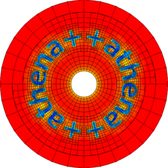

# Two-Moment Cosmic-Ray Fluid Module for Athena++
[](https://github.com/X1Hu1Zhao/Athena_CRMHD/releases/latest)
[](LICENSE)
[](https://doi.org/10.3847/1538-4365/ae3e7f)
[](https://www.repostatus.org/#active)



This project extends Athena++ with a multi-species, two-moment cosmic-ray (CR) fluid module. For each CR species, it evolves the lab-frame CR energy density $`\mathcal{E}_{\mathrm{cr}}`$ and the three components of the CR energy flux $`\boldsymbol{F}_{\mathrm{cr}}`$, coupling CR transport and feedback to the MHD gas through Alfvén-wave scattering.

The module is designed for macroscopic simulations of CR feedback on galactic gas, including the interstellar and circumgalactic medium (ISM and CGM). Effective coupling terms represent the cumulative effects of microscopic interactions. The model assumes that resonant scattering dominates CR–plasma coupling and that unresolved wave growth and damping reach local equilibrium on the simulation scale.

Our framework includes an anisotropic CR pressure tensor and allows different Alfvén-wave propagation directions and polarizations. The numerical implementation combines an adaptive HLLE Riemann solver with a second-order implicit integrator. Tests of coupled CR–MHD waves show agreement with the predictions of perturbation theory. The current implementation and validation limits are described in [Known Limitations](docs/known_limitations.md).

For a systematic understanding of the physical framework and numerical methods, please refer to our method paper:
*Cosmic Ray Magnetohydrodynamics: A New Two-Moment Framework with Numerical Implementation*, ApJS, Volume 283, Issue 1, id.37, 25 pp.
[doi:10.3847/1538-4365/ae3e7f](https://ui.adsabs.harvard.edu/link_gateway/2026ApJS..283...37Z/doi:10.3847/1538-4365/ae3e7f)


## Governing Equations

The module solves the following lab-frame two-moment system:

```math
\frac{\partial \mathcal{E}_{\rm cr}}{\partial t}
+\boldsymbol{\nabla}\!\cdot\boldsymbol{F}_{\rm cr}=S_E,
```

```math
\frac{1}{V_m^2}\frac{\partial \boldsymbol{F}_{\rm cr}}{\partial t}
+\boldsymbol{\nabla}\!\cdot\mathbf{P}_{\rm cr}=\boldsymbol{S}_F.
```

The full source terms, notation, and physical interpretation are given in [Physical Model](docs/physical_model.md).

Internally, each CR species stores the following conserved variables:

```math
\boldsymbol{q}
=\left(\mathcal{E}_{\rm cr},
\frac{F_{{\rm cr},1}}{V_m},
\frac{F_{{\rm cr},2}}{V_m},
\frac{F_{{\rm cr},3}}{V_m}\right)^T.
```

$V_m$ is the reduced numerical speed of light.


## Citation

When publishing results obtained with this module, please cite both the CR formulation and the Athena++ framework:

1. **The CR theory and methods paper:**
Xihui Zhao, Xue-Ning Bai, and Eve C. Ostriker
*Cosmic Ray Magnetohydrodynamics: A New Two-Moment Framework with Numerical Implementation*, ApJS, Volume 283, Issue 1, id.37, 25 pp.
[doi:10.3847/1538-4365/ae3e7f](https://ui.adsabs.harvard.edu/link_gateway/2026ApJS..283...37Z/doi:10.3847/1538-4365/ae3e7f)

```bibtex
@ARTICLE{2026ApJS..283...37Z,
       author = {{Zhao}, Xihui and {Bai}, Xue-Ning and {Ostriker}, Eve C.},
        title = "{Cosmic-ray Magnetohydrodynamics: A New Two-moment Framework with Numerical Implementation}",
      journal = {\apjs},
     keywords = {Cosmic rays, Cosmic ray astronomy, Computational methods, Magnetohydrodynamics, Plasma astrophysics, Interstellar medium, Circumgalactic medium, Perturbation methods, 329, 324, 1965, 1964, 1261, 847, 1879, 1215, High Energy Astrophysical Phenomena, Astrophysics of Galaxies},
         year = 2026,
        month = mar,
       volume = {283},
       number = {1},
          eid = {37},
        pages = {37},
          doi = {10.3847/1538-4365/ae3e7f},
archivePrefix = {arXiv},
       eprint = {2509.04387},
 primaryClass = {astro-ph.HE},
       adsurl = {https://ui.adsabs.harvard.edu/abs/2026ApJS..283...37Z},
      adsnote = {Provided by the SAO/NASA Astrophysics Data System}
}
```


2. **The Athena++ methods paper:**
Stone, J. M., Tomida, K., White, C. J., & Felker, K. G. 2020, *ApJS*, 249, 4
[doi:10.3847/1538-4365/ab929b](https://doi.org/10.3847/1538-4365/ab929b)

```bibtex
@ARTICLE{2020ApJS..249....4S,
       author = {{Stone}, James M. and {Tomida}, Kengo and {White}, Christopher J. and {Felker}, Kyle G.},
        title = "{The Athena++ Adaptive Mesh Refinement Framework: Design and Magnetohydrodynamic Solvers}",
      journal = {\apjs},
     keywords = {Astronomy software, Magnetohydrodynamics, 1855, 1964, Astrophysics - Instrumentation and Methods for Astrophysics, Physics - Computational Physics},
         year = 2020,
        month = jul,
       volume = {249},
       number = {1},
          eid = {4},
        pages = {4},
          doi = {10.3847/1538-4365/ab929b},
archivePrefix = {arXiv},
       eprint = {2005.06651},
 primaryClass = {astro-ph.IM},
       adsurl = {https://ui.adsabs.harvard.edu/abs/2020ApJS..249....4S},
      adsnote = {Provided by the SAO/NASA Astrophysics Data System}
}
```


## Documentation Map

- [Examples](docs/examples.md) — for new users who want to get started quickly with hands-on examples. Provides step-by-step instructions for building, running, and plotting several test problems.
- [Physical Model](docs/physical_model.md) — for readers who want to understand the physics and assess its suitability for their problem. Explains the equations, notation, scattering closures, and pressure anisotropy.
- [Numerical Algorithm](docs/numerical_algorithm.md) — for users who want to understand the numerical methods and developers who plan to extend the module. Follows one integration stage through the main data structures, transport and source updates, and timestep constraints.
- [Parameter Reference](docs/parameter_reference.md) — for users configuring a simulation or implementing a custom scattering model. Summarize build options, input parameters, output selectors, callbacks, and supported method combinations.
- [Known Limitations](docs/known_limitations.md) — for all users, especially those applying the module to a new physical regime or numerical configuration. Describes the validation scope, modeling assumptions, and unsupported or experimental features.


## License and Upstream Attribution

This module is distributed within an Athena++ source tree under the repository's BSD 3-Clause license. Preserve upstream Athena++ copyright and license notices when redistributing modified source files.
