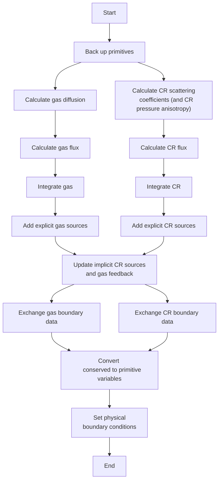

# Numerical Algorithm

## 1. Purpose and Reading Guide

This page follows one Athena++ time-integrator stage through the CR module. It explains the numerical role of each operation and identifies the implementation entry points. It is intended for users who want to understand the numerical controls and for developers extending the module.

Code blocks are focused excerpts or schematic examples; they omit surrounding setup and are not standalone programs.


## 2. Main Classes and Data

| Component | Main class or function | Source location |
|---|---|---|
| CR state, scattering-coefficient arrays, and numerical fluxes | `CosmicRay` | `src/cosmic_ray/cosmic_ray.hpp` |
| Scattering models, source-term integrators, matrix operations, and scattering timestep constraint | `CRScattering` | `src/cosmic_ray/cr_scattering/` |
| Explicit CR sources, including point-mass and pressure-anisotropy terms | `CosmicRaySourceTerms` | `src/cosmic_ray/srcterms/` |
| Spatial reconstruction for CR variables | `Reconstruction::*CosmicRay` | `src/reconstruct/` |
| Conserved/primitive variables conversion | `EquationOfState::*CosmicRay` | `src/eos/eos_cosmic_ray.cpp` |
| Stage scheduling | `TimeIntegratorTaskList` | `src/task_list/time_integrator.cpp` |
| Output registration | `OutputType::LoadOutputData` | `src/outputs/outputs.cpp` |

The `MeshBlock` member `cr_pointer` points to the block's `CosmicRay` object.

The major CR arrays are:

| Array | Role |
|---|---|
| `cr_cons` | Conserved CR state registered with the `MeshBlock` |
| `cr_prim` | Primitive CR state used for reconstruction and scattering-coefficient calculations |
| `cr_flux[3]` | Face-centered numerical fluxes of the CR conserved variables in each active direction; these are distinct from the physical CR energy flux $\boldsymbol{F}_{\rm cr}$ |
| `cr_cons1`, `cr_cons2`, `cr_prim1`, `cr_prim_n`, `sigma_*_array_n` | Time-integrator stage registers |
| `cr_cons_af_src` | State after the flux-divergence and explicit-source updates, before implicit scattering |
| `deltaPcr` | Cell-centered CR pressure-anisotropy array with one scalar entry per CR species. Access the value for a species as `deltaPcr(CR_id,k,j,i)`. |
| `b_interface_l_`, `b_interface_r_`, `b_interface_lb_` | Temporary three-component arrays that store the left and right interface magnetic fields used by the CR Riemann solver. |
| `sigma_*_array` | Cell-centered scattering coefficients |

For the $n$-th CR species, with $n=1,\ldots,\texttt{NCRS}$, the array indices are

```cpp
Fluid_id = n;
CR_id    = n-1;
cr_energy_id = 4*CR_id;
cr_flux1_id  = cr_energy_id + 1;
cr_flux2_id  = cr_energy_id + 2;
cr_flux3_id  = cr_energy_id + 3;
```

The flux components store $F_{{\rm cr},i}/V_m$, not $F_{{\rm cr},i}$.

`Fluid_id = 0` is reserved for the MHD gas.


## 3. One-Stage Execution Flow

The exact dependency graph changes when additional Athena++ features, such as mesh refinement or passive scalars, are enabled. The central CR path is:



Scattering is applied after the explicit source updates. The following sections describe each step in detail.

## 4. Step 1: Set Scattering Properties

**Task:** `PROPERTIES_CR`  
**Entry point:** `CRScattering::SetProperties`  
**Source:** `src/cosmic_ray/cr_scattering/scattering_properties.cpp`

At the beginning of each stage, the module evaluates the five scattering-coefficient arrays and `deltaPcr` together, using either a built-in model or a user-defined scattering function (callback).

This grouping is intentional: both the scattering coefficients and pressure anisotropy represent unresolved microphysics and are supplied through local prescriptions. After either a built-in prescription or a user callback is evaluated, setting `pressure_anisotropy_flag = false` clears `deltaPcr`, overriding any assigned value. This safeguard is intended to remind users to exercise caution when implementing their own pressure-anisotropy prescriptions.


The control flow is summarized below.

```cpp
void CRScattering::SetProperties(const Real time, const AthenaArray<Real> &w,
    const AthenaArray<Real> &cr_prim, const AthenaArray<Real> &bcc) {
  // Determine the active and ghost-zone index ranges.

  if (Scattering_Flag) {
    if (UserDefinedCRScattering == nullptr) {
      if (coefficient_model_ == "streaming") {
        SetStreamingScatteringCoefficients(
            w, cr_prim, bcc,
            cr_pointer->sigma_pL_array, cr_pointer->sigma_pR_array,
            cr_pointer->sigma_mL_array, cr_pointer->sigma_mR_array,
            cr_pointer->sigma_Lorentz_array, cr_pointer->deltaPcr,
            scattering_il, scattering_iu, scattering_jl, scattering_ju,
            scattering_kl, scattering_ku);
      } else {
        SetConstantScatteringCoefficients(
            cr_pointer->sigma_pL_array, cr_pointer->sigma_pR_array,
            cr_pointer->sigma_mL_array, cr_pointer->sigma_mR_array,
            cr_pointer->sigma_Lorentz_array, cr_pointer->deltaPcr,
            is, ie, js, je, ks, ke);
      }
    } else {
      UserDefinedCRScattering(
          cr_pointer, pmb_, w, cr_prim, bcc, 
          cr_pointer->sigma_pL_array, cr_pointer->sigma_pR_array,
          cr_pointer->sigma_mL_array, cr_pointer->sigma_mR_array,
          cr_pointer->sigma_Lorentz_array, cr_pointer->deltaPcr, cs_cr_array,
          il, iu, jl, ju, kl, ku);
    }
  }

  if (!cr_pointer->PressureAnisotropyEnabled()) {
    cr_pointer->deltaPcr.ZeroClear();
  }
}
```
The built-in models call `SetStreamingScatteringCoefficients` or `SetConstantScatteringCoefficients`. To supply a custom model, define a function with the following signature in the problem generator:

```cpp
void FunctionName(
    CosmicRay *cr_pointer, MeshBlock *pmb,
    const AthenaArray<Real> &w, const AthenaArray<Real> &cr_prim,
    const AthenaArray<Real> &bcc,
    AthenaArray<Real> &sigma_pL, AthenaArray<Real> &sigma_pR,
    AthenaArray<Real> &sigma_mL, AthenaArray<Real> &sigma_mR,
    AthenaArray<Real> &sigma_Lorentz, AthenaArray<Real> &deltaPcr,
    AthenaArray<Real> &cs_cr,
    int is, int ie, int js, int je, int ks, int ke);
```

Implement the function and register it with `EnrollCRScatteringCoefficients(FunctionName);` inside `Mesh::InitUserMeshData`. Set `Scattering_Flag = true` to enable coefficient updates.

The following template shows the function loop structure; replace each placeholder with the intended physical closure before compiling:

```cpp
void MyCRScatteringCoefficients(
    CosmicRay *cr_pointer, MeshBlock *pmb,
    const AthenaArray<Real> &w,
    const AthenaArray<Real> &cr_prim,
    const AthenaArray<Real> &bcc,
    AthenaArray<Real> &sigma_pL,
    AthenaArray<Real> &sigma_pR,
    AthenaArray<Real> &sigma_mL,
    AthenaArray<Real> &sigma_mR,
    AthenaArray<Real> &sigma_Lorentz,
    AthenaArray<Real> &deltaPcr,
    AthenaArray<Real> &cs_cr,
    int is, int ie, int js, int je, int ks, int ke) {
  for (int CR_id = 0; CR_id < NCRS; ++CR_id) {
    for (int k = ks; k <= ke; ++k) {
      for (int j = js; j <= je; ++j) {
#pragma omp simd
        for (int i = is; i <= ie; ++i) {
          sigma_pL(CR_id,k,j,i) = /* physical closure */;
          sigma_pR(CR_id,k,j,i) = /* physical closure */;
          sigma_mL(CR_id,k,j,i) = /* physical closure */;
          sigma_mR(CR_id,k,j,i) = /* physical closure */;
          sigma_Lorentz(CR_id,k,j,i) = /* physical closure */;
          deltaPcr(CR_id,k,j,i) = /* physical closure */;
        }
      }
    }
  }
}
```

The registered function must fill all five scattering-coefficient arrays and `deltaPcr` for every requested cell and CR species, including the supplied ghost zones.

A non-zero `deltaPcr` supplied by a user callback is retained only when `pressure_anisotropy_flag = true`. Otherwise, `SetProperties` clears the complete array after the prescription returns.

The built-in constant and streaming prescriptions set `deltaPcr(CR_id,k,j,i) = 0.0`, thereby disabling CR pressure-anisotropy effects. Users may adopt the same choice when focusing on conventional problems in which streaming-driven transport is assumed to dominate.

Users are responsible for ensuring non-negative wave-scattering coefficients, a physically consistent CR pressure-anisotropy prescription, dimensional consistency, complete ghost-zone coverage, and any additional timestep constraints required by their closure. The built-in streaming timestep correction is not applied to user-defined functions.

See [User-Defined Scattering](parameter_reference.md#4-user-defined-scattering) for the full interface requirements.

## 5. Step 2: Reconstruct States and Compute CR Fluxes

### 5.1 Reconstruct States

**Task:** `CALC_CRFLX`  
**Entry point:** `CosmicRay::CalculateCosmicRayFluxes`  
**Source:** `src/cosmic_ray/calculate_cosmic_ray_fluxes.cpp`

For the recommended second-order path, `CosmicRay::CalculateCosmicRayFluxes` applies piecewise-linear reconstruction to the four variables of each CR species. The magnetic field at each interface is prepared separately by `DonorCellX1_MagneticField` and passed through the `b_interface_*` arrays. With `solver_id = 2`, these reconstructed CR states and interface magnetic fields are passed to `HLLENoCsRiemannSolverCosmicRay`. The `deltaPcr` array is also reconstructed as a scalar.


```cpp
pmb->precon->PiecewiseLinearX1_CosmicRay(
    k, j, is-1, ie+1, cr_prim, cr_prim_l_, cr_prim_r_);
pmb->precon->PiecewiseLinearX1_CosmicRay(
    k, j, is-1, ie+1, deltaPcr, deltaPcr_l_, deltaPcr_r_);
pmb->precon->DonorCellX1_MagneticField(
    k, j, is-1, ie+1, b1, bcc,
    b_interface_l_, b_interface_r_);

HLLENoCsRiemannSolverCosmicRay(
    k, j, is, ie+1, 1, b1, w,
    cr_prim_l_, cr_prim_r_, b_interface_l_, b_interface_r_,
    deltaPcr_l_, deltaPcr_r_,
    pmb->phydro->wl_, pmb->phydro->wr_, x1flux);
```

The $x_2$ and $x_3$ sweeps are performed only when those mesh directions are active.

The reconstructed $\Delta P_{\rm cr}$ enters the full interface pressure tensor, but the default built-in prescriptions set $\Delta P_{\rm cr}=0$, so the standard configuration reduces exactly to the isotropic interface pressure $\mathcal{E}_{\rm cr}\mathbf{I}/3$. Users may manually turn it on by setting their own $\Delta P_{\rm cr}$ prescriptions in `UserDefinedCRScattering`, and `pressure_anisotropy_flag = true` in the input file.


### 5.2 Compute interface CR fluxes

The transport part of the CR equations is

```math
\frac{\partial\boldsymbol{q}}{\partial t}
+\boldsymbol{\nabla}\cdot\mathbf{f}=0,
```

with

```math
\boldsymbol{q}=
\begin{pmatrix}
\mathcal{E}_{\rm cr}\\
F_{{\rm cr},x}/V_m\\
F_{{\rm cr},y}/V_m\\
F_{{\rm cr},z}/V_m
\end{pmatrix},
\qquad
\mathbf{f}=
\begin{pmatrix}
F_x & F_y & F_z\\
V_mP_{xx} & V_mP_{xy} & V_mP_{xz}\\
V_mP_{yx} & V_mP_{yy} & V_mP_{yz}\\
V_mP_{zx} & V_mP_{zy} & V_mP_{zz}
\end{pmatrix}.
```

At the $(k,j,i-1/2)$ interface, the HLLE flux is

```math
\boldsymbol{F}^{\rm HLLE}_{i-1/2}
=\frac{V^+\boldsymbol{f}(\boldsymbol{q}_L)
-V^-\boldsymbol{f}(\boldsymbol{q}_R)
+V^+V^-(\boldsymbol{q}_R-\boldsymbol{q}_L)}{V^+-V^-}.
```
where $\boldsymbol{q}_L$ and $\boldsymbol{q}_R$ are the reconstructed left and right states, and $V^+$ and $V^-$ are the bounding signal speeds used by HLLE.


The solver first computes gas density, sound speed, magnetic geometry, and Alfvén speed once per interface. It stores those values in `HLLE_aux_`, then loops over CR species. This avoids repeating MHD-only work for each species.

The signal-speed prescription distinguishes three regimes:

| Regime | Characteristic magnitude |
|---|---|
| Weak scattering | $V_m/\sqrt{3}$ |
| Intermediate scattering | $2\times\max(C_s,v_A)$ |
| Strong coupled regime | $2\times C_{\max}\equiv 2\sqrt{C_s^2+C_{\rm cr}^2+v_A^2}$ |

For a given wavenumber $k$ and total scattering coefficient $\sigma$, the characteristic signal speed is

```math
V_{\rm signal}(k)=\begin{cases}
V_m/\sqrt{3}, & \sigma/k<\sqrt{3}/V_m\\
2\times {\rm max}(C_s,v_A), & \sqrt{3}/V_m<\sigma/k<1/(10C_{\rm max})\\
2\times C_{\rm max}, & 1/(10C_{\rm max})<\sigma/k

\end{cases}
```


The prescription is evaluated at both the local grid scale and the full-domain scale, and the larger speed is selected. The following expression summarizes that scale selection:

```math
V_{\rm HLLE}^+=\max\left[V_{\rm signal}(\Delta x),\ V_{\rm signal}(L_{\rm box})\right]\\
V_{\rm HLLE}^{-}=-V_{\rm HLLE}^+
```

In the implementation, the field-aligned speeds are projected onto the sweep direction and combined with the gas velocity. The resulting one-sided bounds are capped by $\pm V_m/\sqrt{3}$:

```cpp
const Real Vwave_l = std::abs(b_ivx_l)*std::max(Vb_l_dx, Vb_l_domain);
const Real Vwave_r = std::abs(b_ivx_r)*std::max(Vb_r_dx, Vb_r_domain);

Real al = std::min(meanadv - meandiffv, gas_V_l - Vwave_l);
Real ar = std::max(meanadv + meandiffv, gas_V_r + Vwave_r);
ar = std::min(ar,  Vm/std::sqrt(3.0));
al = std::max(al, -Vm/std::sqrt(3.0));
```

Magnetic-frame transformations are provided by the shared helpers in `src/cosmic_ray/cr_frame_transform.hpp`. In the current HLLE path, the helper converts the field-aligned unit vector to the lab frame so the solver can obtain the magnetic-field projection onto the active coordinate direction.

## 6. Step 3: Add the Flux Divergence

**Task:** `INT_CR`  
**Entry point:** `CosmicRay::AddCosmicRayFluxDivergence`  
**Source:** `src/cosmic_ray/add_cosmic_ray_flux_divergence.cpp`

Athena++ updates the cell average using geometry-aware face areas and cell volumes:

```math
\boldsymbol{q}^{*}_{ijk}
=\boldsymbol{q}^{n}_{ijk}
-w\frac{1}{V_{ijk}}
\sum_d\left(A_{d,+}\boldsymbol{F}_{d,+}
-A_{d,-}\boldsymbol{F}_{d,-}\right),
```

where $w$ includes the stage's timestep weight. The implementation adds transverse contributions only in active mesh directions:

```cpp
dflx(n,i) = x1area(i+1)*x1flux(n,k,j,i+1)
          - x1area(i  )*x1flux(n,k,j,i);

if (pmb->block_size.nx2 > 1) dflx(n,i) += x2_flux_difference;
if (pmb->block_size.nx3 > 1) dflx(n,i) += x3_flux_difference;

cr_cons_out(n,k,j,i) -= wght*dflx(n,i)/vol(i);
```

This is a conservative finite-volume update. Within this operation, Athena++ face-area and cell-volume methods account for the coordinate geometry.

## 7. Step 4: Add Explicit Source Terms

**Task:** `SRCTERM_CR`  
**Entry point:** `CosmicRaySourceTerms::AddCosmicRaySourceTerms`  
**Source:** `src/cosmic_ray/srcterms/cosmic_ray_srcterms.cpp`

This task applies sources handled explicitly, separately from the main scattering solve. The excerpt shows the point-mass, constant-acceleration, and prescribed pressure-anisotropy sources:

```cpp
if (flag_point_mass_)
  PointMassCosmicRay(dt, cr_flux, cr_prim, cr_cons);

if (g1_ != 0.0 || g2_ != 0.0 || g3_ != 0.0)
  ConstantAccelerationCosmicRay(dt, cr_flux, cr_prim, cr_cons);

if (cr_pointer->PressureAnisotropyEnabled())
  PressureAnisotropySource(dt, cr_flux, cr_prim, cr_cons,
      cr_pointer->deltaPcr,
      cr_pointer->sigma_pL_array, cr_pointer->sigma_pR_array,
      cr_pointer->sigma_mL_array, cr_pointer->sigma_mR_array, bcc);
```
The pressure-anisotropy source is explicit and should therefore be included in timestep-convergence checks when active. To use it, assign `deltaPcr(CR_id,k,j,i)` alongside the scattering coefficients and set `pressure_anisotropy_flag = true`.

Setting `pressure_anisotropy_flag = false` is a module-level veto: `SetProperties` clears `deltaPcr`, the HLLE transport flux reduces to the isotropic closure, and the explicit pressure-anisotropy source is skipped. The built-in constant and streaming prescriptions also set `deltaPcr` to zero by default.

## 8. Step 5: Integrate Stiff Scattering and Gas Feedback

**Task:** `SCATTER_CR`  
**Entry point:** `CRScattering::ScatteringIntegrator`  
**Source:** `src/cosmic_ray/cr_scattering/`

The scattering task updates the stiff source terms that depend on $\mathcal{E}_{\rm cr}$ and $\boldsymbol{F}_{\rm cr}$. It runs after the explicit source-term updates. We recommend the following second-order combination:

```ini
<time>
integrator = vl2

<cosmic_ray>
scattering_integrator = 2nd-implicit
```

Here, `integrator = vl2` selects Athena++'s global time integrator, while `scattering_integrator = 2nd-implicit` selects the CR scattering source-term update used within that integrator. The maintained second-order implicit path described in this guide pairs `vl2` with `2nd-implicit`.

### 8.1 Second-order integration

The recommended VL2 scheme first advances the conserved state over half a timestep:

```math
\boldsymbol{q}^{(n+1/2)}
=\left(\mathbf{I}-\frac{\Delta t}{2}\mathbf{S}^{(n)}\right)^{-1}
\left(\boldsymbol{q}^{(n)}+\Delta\boldsymbol{q}_{\rm af,src}^{(n)}\right).
```

It then uses the half-step state to update $\mathbf{S}$ and advances over the full timestep $\Delta t$:

```math
\boldsymbol{q}^{(n+1)} - \boldsymbol{q}^{(n)}=\mathbf{\Lambda}^{-1}\left(\mathbf{I}-\frac{\Delta t}{2}\mathbf{S}^{(n+1/2)}\right)\times \Delta t\left(\mathbf{S}^{(n+1/2)}\boldsymbol{q}^{(n)}+\Delta \boldsymbol{q}_{\rm af,src}^{(n+1/2)}\right)
```

The meaning of the symbols is listed below:

| Symbol | Definition |
|---|---|
| $\boldsymbol{q}^{(n)}$ | Conserved state at the beginning of step $n$ |
| $\mathbf{I}$ | Identity matrix |
| $\Delta t$ | Timestep for one full step, comprising two stages in VL2 |
|$\mathbf{\Lambda}$ | $\mathbf{I}-\left(\mathbf{I} - \frac{\Delta t}{2}\mathbf{S}^{(n+1/2)}\right)\Delta t \mathbf{S}^{(n+1/2)}$ |
| $\Delta \boldsymbol{q}_{\rm af,src}^{(n)}$ | State increment from the flux-divergence and explicit-source updates, measured relative to the state at the beginning of the full integration stage |
| $\mathbf{S}^{(n)}$ | The matrix $\mathbf{S}$ is obtained by reorganizing the implicit source term into the form $\mathbf{S}\boldsymbol{q}$, and the superscript $(n)$ denotes the $n$-th step. The exact form is: $\mathbf{S}=\begin{pmatrix}\frac{4}{3}\sum\limits_{i=\pm}\sigma_i w_i^2 & -\sum\limits_{i=\pm}\sigma_i w_i & -A\sigma_{\Omega}u_z' & -A\sigma_{\Omega}u_y'\\ \frac{4}{3}\sum\limits_{i=\pm}\sigma_i w_i & -V_m\sum\limits_{i=\pm}\sigma_i & 0 & 0\\ -4A\sigma_{\Omega}V_m u_z'/3 & 0 & 0 & A\sigma_{\Omega}V_m\\ 4A\sigma_{\Omega}V_m u_y'/3 & 0 & -A\sigma_{\Omega}V_m & 0\end{pmatrix}$ |

Matrix products retain the order shown. The displayed form of $\mathbf{S}$ applies in the field-aligned frame, where $\boldsymbol{b}\parallel\hat{x}$. Primes denote gas-velocity components in this frame, and $w_\pm\equiv\boldsymbol{u}\cdot\boldsymbol{b}\pm v_A$ are the wave velocities along the field.


### 8.2 Field-aligned frame

The integrator constructs a field-aligned frame from the cell-centered magnetic field, rotates gas and CR vectors into that frame, evaluates the coupling, and rotates the increments back to the lab frame. In each cell, the forward rotation uses

```math
\mathbf{R}=\begin{pmatrix}{\rm cos}\phi_B {\rm sin}\theta_B & {\rm sin}\phi_B {\rm sin}\theta_B & {\rm cos}\theta_B \\
-{\rm sin}\phi_B & {\rm cos}\phi_B & 0\\
-{\rm cos}\phi_B {\rm cos}\theta_B & -{\rm sin}\phi_B{\rm cos}\theta_B & {\rm sin}\theta_B
\end{pmatrix}
```
with

```math
{\rm cos}\phi_B\equiv \frac{B_x}{\sqrt{B_x^2 + B_y^2}},\ {\rm sin}\phi_B\equiv\frac{B_y}{\sqrt{B_x^2+B_y^2}}\\
\ \\
{\rm cos}\theta_B\equiv B_z/B,\ {\rm sin}\theta_B\equiv\sqrt{1-{\rm cos}^2 \theta_B}
```


After evaluating the coupling, the inverse rotation $\mathbf{R}^{-1}$ returns the increments to the lab frame.


### 8.3 Feedback update

The current VL2/`2nd-implicit` and RK1/`1st-implicit` paths support all three feedback modes. The dispatcher selects `VL2ImplicitNoFeedback` or `BackwardEulerNoFeedback` when `CRFeedback_Flag = false`; the corresponding `NoEnergyFeedback` routine for momentum-only feedback; and the `Feedback` routine for full feedback.

1. **No feedback:** CR feedback on gas and the CR-energy source are disabled. CR energy changes only through the divergence of $\boldsymbol{F}_{\rm cr}$:

```cpp
            // No source term update for Ecr
            Fcr1 += CR_delta_mom1_implicit;
            Fcr2 += CR_delta_mom2_implicit;
            Fcr3 += CR_delta_mom3_implicit;
```


2. **Momentum feedback:** CR momentum transfer updates the gas momentum and the corresponding kinetic energy. The CR-energy source remains active:

```cpp
            Ecr  += CR_delta_dens_implicit;
            Fcr1 += CR_delta_mom1_implicit;
            Fcr2 += CR_delta_mom2_implicit;
            Fcr3 += CR_delta_mom3_implicit;

            Real &gas_erg  = u(IEN, k, j, i);
            Real &gas_mom1 = u(IM1, k, j, i);
            Real &gas_mom2 = u(IM2, k, j, i);
            Real &gas_mom3 = u(IM3, k, j, i);
            
            Real Ek_previous = 0.5*(SQR(gas_mom1) + SQR(gas_mom2) + SQR(gas_mom3))*inv_gas_rho(i);

            gas_mom1      -= (inv_Vm*CR_delta_mom1_implicit);
            gas_mom2      -= (inv_Vm*CR_delta_mom2_implicit);
            gas_mom3      -= (inv_Vm*CR_delta_mom3_implicit);

            Real Ek_current  = 0.5*(SQR(gas_mom1) + SQR(gas_mom2) + SQR(gas_mom3))*inv_gas_rho(i);

            gas_erg += (Ek_current - Ek_previous);
```

This mode represents cases in which CR energy is not efficiently deposited as gas heat, or the heating is approximately offset by another cooling process.

3. **Full feedback:** CRs exchange both energy and momentum with the gas:

```cpp
            Ecr  += CR_delta_dens_implicit;
            Fcr1 += CR_delta_mom1_implicit;
            Fcr2 += CR_delta_mom2_implicit;
            Fcr3 += CR_delta_mom3_implicit;

            Real &gas_erg  = u(IEN, k, j, i);
            Real &gas_mom1 = u(IM1, k, j, i);
            Real &gas_mom2 = u(IM2, k, j, i);
            Real &gas_mom3 = u(IM3, k, j, i);
            
            gas_erg       -= CR_delta_dens_implicit;
            gas_mom1      -= (inv_Vm*CR_delta_mom1_implicit);
            gas_mom2      -= (inv_Vm*CR_delta_mom2_implicit);
            gas_mom3      -= (inv_Vm*CR_delta_mom3_implicit);
```


## 9. Step 6: Boundaries and Conserved-to-Primitive Conversion

After scattering, Athena++ exchanges CR boundary data and runs `CONS2PRIM`. The `PHY_BVAL` task then applies physical boundary conditions, as shown in the flowchart.

**Entry point:** `EquationOfState::CosmicRayConservedToPrimitive`  
**Source:** `src/eos/eos_cosmic_ray.cpp`

The CR primitive and conserved states use the same variable definitions. Conversion copies the values and applies a floor to the CR energy density:

```cpp
cons_cr_energy = std::max(cons_cr_energy, cr_floor_[cr_id]);
prim_cr_energy = cons_cr_energy;
prim_cr_flux1  = cons_cr_flux1;
prim_cr_flux2  = cons_cr_flux2;
prim_cr_flux3  = cons_cr_flux3;
```


## 10. Step 7: Compute the Next Timestep

**Task:** `NEW_DT`  
**Entry points:** `CosmicRay::NewAdvectionDt`, `CRScattering::NewScatteringDt`

### 10.1 Hyperbolic transport limit

The CR advection limit is the smallest active-direction cell width divided by $V_m$:

```math
\Delta t_{\rm adv,CR}=\frac{\min(\Delta x, \Delta y,\Delta z)}{V_m}
```

Athena++ applies the global CFL factor when combining the timestep constraints.

### 10.2 Streaming-scattering limit

For the built-in streaming model, the restriction uses the largest `sigma0_streaming_N` among all CR species. The author's stated stability bound is

```math
\Delta t_{\rm scatt}
=\frac{\sqrt{3}}
{1+4 \max_{\rm species} \widetilde{\sigma}_{0,\rm st}}\frac{\min(\Delta x,\Delta y,\Delta z)}{V_m}.
```


The stability analysis motivating this special treatment applies to the built-in streaming closure. Other coefficient models currently use $\Delta s_{\min}/V_m$ as a reference bound; it is not a stability guarantee for an arbitrary closure.

## 11. Recommended Numerical Path

For the current release, use:

```ini
<time>
integrator = vl2
xorder     = 2
cfl_number = 0.3

<cosmic_ray>
cr_xorder          = 2
solver_id          = 2
gamma_cr           = 1.3333333333333333
scattering_integrator  = 2nd-implicit
```

For every new scattering closure, we recommend testing convergence with respect to both spatial resolution and timestep.
